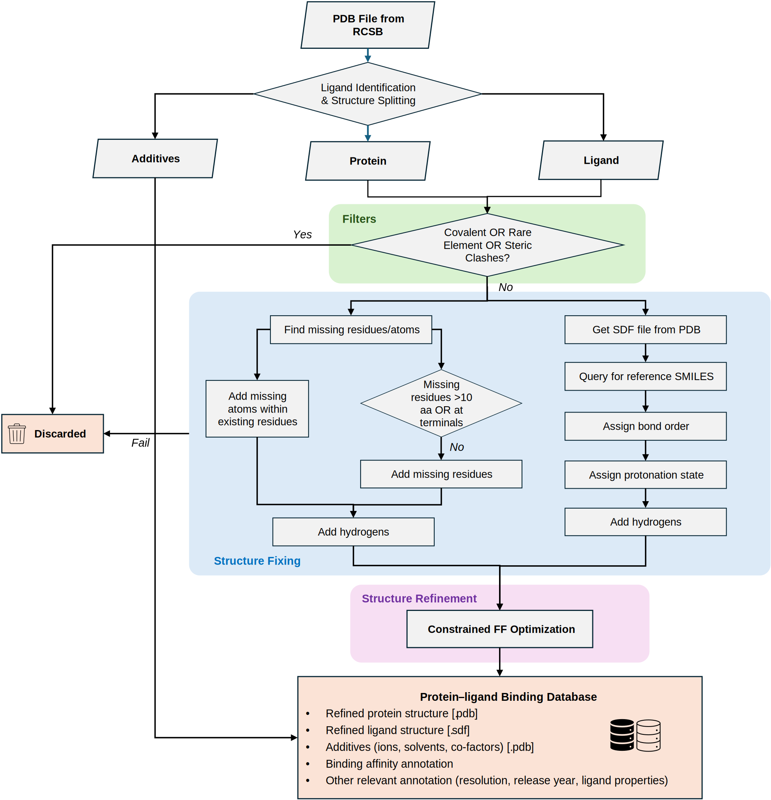

# PDBBind-Opt Workflow

This repository contains scripts of PDBBind-Opt workflow, which organizes a bunch of open-source softwares to probe and fix structural problems in PDBBind.



## Code availability

+ `pre_process/`: Scripts to prepare PDBBind and BioLiP dataset (identifying ligands and extract binding affinity data)
+ `workflow/`: Codes for PDBBind-Opt worflow
  - `dimorphite_dl`: Package to assign protonation states. We modified the `site_substructures.smarts` to make the rules easier.
  - `fix_ligand.py`: LigandFixer module
  - `fix_protein.py`: ProteinFixer module
  - `process.py`: Main workflow
  - `rcsb.py`: Functions to query RCSB (i.e. downloading files, query SMILES strings)
  - `gather.py`: Functions to create metadata csv files
  - `fix_polymer.py`: Functions to fix polymer ligands
  - `maual_smiles.json`: Manually corrected reference SMILES
  - `building_blocks.csv`: SMILES of alpha-amino acids and common N/C terminal caps. Used to create reference SMILES for polymers
+ `error_fix/`: Contains some error analysis
+ `figshare/`: Metadata of BioLiP2-Opt and PDBBind-Opt dumped in Figshare repo.

## How to reconstruct PDBBind-Opt and BioLiP-Opt

+ **Step 1**: Download PDBBind index file from their official website. Run `download.sh` in the `pre_process` to download BioLiP2 dataset
+ **Step 2**: Run `pre_process/create_dataset_csv.ipynb` to extract binding affinity and identifying ligands. This will give the three csv files
+ **Step 3**: Go to the `workflow` and use the following command to run the workflow
```bash
mkdir ../raw_data
python procees.py -i ../pre_process/BioLiP_bind_sm.csv -d ../raw_data/biolip2_opt
python procees.py -i ../pre_process/PDBBind_poly.csv -d ../raw_data/pdbbind_opt_poly --poly
python procees.py -i ../pre_process/PDBBind_sm.csv -d ../raw_data/pdbbind_opt_sm
```
This will take about one day on a 256-core CPU. If you have more nodes, considering split the input csv file to several chunks and run them in parallel. When the workflow finish, in the output directory, each PDBID will have a folder and if the workflow succeed on this PDBID, there will be a file named `done.tag` under its folder, otherwise ther will be a file named `err`. 
+ **Step 4**: Run the `gather.py` to create metadata files, for example:
```bash
python gather.py -i ../pre_process/BioLiP_bind_sm.csv -d ../raw_data/biolip2_opt -o ../figshare/biolip2_opt/biolip2_opt.csv
```